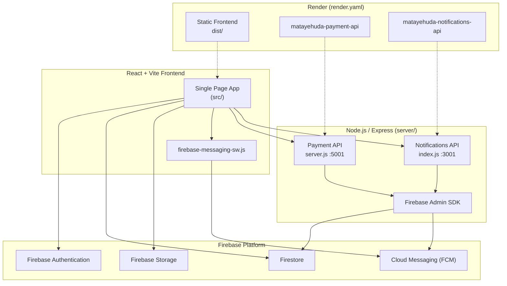

# Kehila Mata Yehuda — Community Management Platform

A full-stack web application for **Kehila Mata Yehuda** (קהילה מטה יהודה), a community organization in Israel. The system connects the public-facing website with internal staff tools for managing programs, participants, registrations, volunteers, payments, donations, attendance, and community support services.

The interface is built primarily in **Hebrew** with **RTL (right-to-left)** layout and responsive support for desktop and mobile.

---

## Table of Contents

- [Team](#-team)
- [Client](#-client)
- [Overview](#-overview)
- [System Architecture](#-system-architecture)
- [Application Flow](#-application-flow)
- [Features](#-features)
- [Technologies Used](#-technologies-used)
- [Project Structure](#-project-structure)
- [Installation](#-installation)
- [Firebase](#-firebase)
- [Main Pages](#-main-pages)
- [User Roles](#-user-roles)
- [Responsive Design](#-responsive-design)
- [Deployment](#-deployment)
- [Future Improvements](#-future-improvements)
- [Privacy and Security](#-privacy-and-security)
- [License](#-license)
- [Additional Documentation](#-additional-documentation)

---

## 👥 Team

This project was collaboratively designed and developed by a team of four Software Engineering students as part of an academic project.

| Member | Contact |
|--------|---------|
| **Raneen Kharma** | Email: [raneenkh@post.jce.ac.il](mailto:raneenkh@post.jce.ac.il) · GitHub: [@raneen12kh](https://github.com/raneen12kh) |
| **Sujood Totah** | GitHub: [@sujood-totah](https://github.com/sujood-totah) |
| **Doha Abdelnabi** | GitHub: [@doha-abdelnabi](https://github.com/doha-abdelnabi) |
| **Widad Rajabi** | GitHub: [@WidadRajabi](https://github.com/WidadRajabi) |

All team members contributed collaboratively to the design, implementation, testing, and documentation of the system. While individual responsibilities varied throughout the project, development was carried out as a joint team effort.

---

## 🏛️ Client

This system was developed for **Mata Yehuda Regional Council** (עמותת מטה יהודה) — a nonprofit community organization serving senior residents across the Mata Yehuda region in Israel.

The organization operates programs including a **Day Center**, **60+ Minus** enriched senior clubs, and a **Supportive Community** initiative that helps seniors age in place. This platform digitizes those operations: it gives the public a modern website for registration, donations, and service requests, while giving staff a centralized dashboard to manage participants, activities, volunteers, payments, attendance, and communications.

---

## 📋 Overview

This platform serves two main audiences:

1. **Public users** — browse programs and activities, register for services, submit requests, volunteer, donate, and opt in to push notifications.
2. **Staff members** — manage organizational data through a secure dashboard, including participants, programs, activities, registrations, cancellations, inquiries, attendance, donations, statistics, and notifications.

The frontend is a **React** single-page application backed by **Firebase** (Authentication, Firestore, Storage, Cloud Messaging). Payment processing, registration workflows, and push-notification delivery are handled by **Node.js/Express** backend services, deployable locally or on **Render**, with optional **Firebase Hosting** and **Cloud Functions** integration.

---

## 🏗 System Architecture

The application follows a **three-tier architecture**: a client-side SPA, Firebase platform services, and dedicated Express APIs for payment and notification workloads.



### Component overview

| Layer | Technology | Role |
|-------|------------|------|
| **Frontend** | React 19 + Vite 8 | Public website, staff dashboard, routing, forms, charts |
| **Authentication** | Firebase Auth | Email/password login for staff; client session management |
| **Database** | Firestore | Participants, registrations, programs, donations, and all operational data |
| **File storage** | Firebase Storage | Program/activity images and Day Center schedule uploads |
| **Push messaging** | Firebase Cloud Messaging | Web push notifications via service worker and token registry |
| **Payment service** | Express (`server/server.js`) | PayPal orders, cash/Bit payments, registration lookup and cancellation |
| **Notification service** | Express (`server/index.js`) | FCM broadcast, token management, delivery logging |
| **Deployment** | Render | Three services: static frontend, payment API, notifications API |

### Data flow summary

- The **frontend** reads and writes most data directly to **Firestore** using the Firebase client SDK.
- **Sensitive operations** (payments, cancellations, push broadcasts) go through **Express APIs** authenticated with the Firebase Admin SDK.
- **Environment variables** (`VITE_*` on the client, server `.env` on the backend) connect each layer without hard-coded secrets.

---

## 🔄 Application Flow

### Public user flow

1. User visits the public website (home, program pages, about, services).
2. User browses activities and calendars on program-specific pages.
3. User may submit an **inquiry** (contact form), **registration** (program or Day Center), **volunteer sign-up**, or **supportive community** request.
4. User may opt in to **push notifications** by registering an FCM token (stored in `notification_tokens`).
5. User may complete a **donation** via PayPal, cash, or Bit on `/donations`.

### Registration flow

1. User fills out a registration form on the public site (home, Day Center, or program page).
2. A **participant** record and **registration** document are created in Firestore.
3. If payment is required, the user is directed to `/pay` (PayPal) or records a cash/Bit payment.
4. The **payment API** (`server/server.js`) creates PayPal orders, captures payments, and writes to the `payments` collection.
5. On success, the user lands on `/payment-success`; on cancel, `/payment-cancel`.
6. Staff review pending registrations in the dashboard and mark them complete.

### Staff workflow

1. Staff member logs in at `/staff-login` via Firebase Authentication.
2. The app verifies the account against the `staff` collection (`is_active` must be `true`).
3. Staff selects a work area: **General Management** or **Supportive Community** (`/staff/area-selection`).
4. In the **staff dashboard** (`/staff/dashboard`), staff manage modules via in-app navigation:
   - Activities, programs, participants, staff accounts
   - Registration requests, inquiries, cancellations
   - Messages, statistics, attendance, donations, Day Center volunteers
5. Staff may also access standalone routes: `/staff/statistics`, `/attendance`, `/requests`, and `/community-staff/*`.

### Notifications flow

1. Public users register FCM tokens through the notification opt-in component.
2. Tokens are stored in Firestore (`notification_tokens`).
3. Staff compose a broadcast message in the dashboard **Messages** module.
4. The frontend calls the **notifications API**, which uses Firebase Admin SDK to send FCM messages.
5. Delivery results are logged in `notifications_log`.

### Donations flow

1. User visits `/donations` and submits a donation (amount, donor details, payment method).
2. PayPal donations are processed through the payment API; cash/Bit donations are recorded directly.
3. Donation records are stored in the `donations` Firestore collection.
4. Staff view donations in the dashboard with summary cards, period-filtered charts (Recharts), and a searchable list.

### Statistics flow

1. Staff open the statistics page (`/staff/statistics` or dashboard module).
2. Staff select a **monthly** or **yearly** period filter and apply a date range.
3. The frontend queries Firestore collections (registrations, cancellations, programs, activities).
4. Aggregated data is rendered as charts and summary metrics via Recharts.

---

## ✨ Features

### Public website

- Home page with program overview, contact footer, and navigation
- Program pages: **Day Center** (`/day-center`), **60+ Minus** (`/plus60`), **Supportive Community** (`/supportive-community`)
- About and Services pages
- Activity listings and calendars on program pages
- Contact / inquiry submission
- **Donation** flow with PayPal, cash, and Bit options (`/donations`)
- **Push notification opt-in** for participants (FCM)
- Program registration forms (Day Center, general programs, volunteer sign-up)

### Supportive Community (public + staff)

- Community information and join flow (`/community-join`)
- Service / help request submission (`/community-service-request`)
- Volunteer registration (`/community-volunteer`)
- Dedicated **Community Staff** area (`/community-staff/*`) for:
  - Dashboard summary
  - Join requests
  - Community members
  - Volunteer requests
  - Volunteer management
  - Help requests
  - Active volunteer matches
  - Settings (languages, help types)

### Programs and activities management

- CRUD for **programs** and **activities** in the staff dashboard
- Activity types, scheduling, images (Firebase Storage)
- Day Center schedule image management
- Activity calendar on the staff dashboard

### Participant and registration management

- Participant records with search, filters, sorting, and pagination
- Registration requests workflow (pending → complete)
- Payment-linked registrations via backend API
- **Archive system** for participants and programs (soft archive with restore and permanent delete)

### Staff dashboard

- Summary cards and control panels (new inquiries, pending requests, cancellations, activity calendar)
- Internal navigation for all management modules
- Mobile-friendly sidebar and navigation
- Area selection after login: **General Management** or **Supportive Community**

### Staff management

- Staff user accounts linked to Firebase Authentication
- Active/inactive staff status enforcement via `staff` Firestore collection

### Volunteer management

- **Day Center volunteers** (`daycenterVolunteers`, `day_center_volunteer_requests`)
- **Supportive Community volunteers** (`volunteers`, matching, help requests)

### Registration requests and cancellations

- View and process pending registration requests
- Cancellation management with refund status tracking
- Server-side registration lookup, cancellation, and payment integration

### Inquiries and requests

- **Inquiries** (`inquiries` collection) — contact form submissions managed in staff dashboard
- **Requests** (`requests` collection) — one-on-one response workflow with WhatsApp integration (`/requests`, staff-only)

### Notifications

- FCM token registration for public users (`notification_tokens`)
- Staff broadcast messages by target group from the dashboard
- Notification log and delivery stats
- Dedicated notifications API (`server/index.js`)

### Donations management

- Public donation page with multiple payment methods
- Staff donations dashboard with summary cards, charts (Recharts), period filter, and donation list

### Statistics dashboard

- Period-based analytics (monthly/yearly filters)
- Charts for registrations, cancellations, programs, and activities
- Available at `/staff/statistics` and inside the staff dashboard

### Attendance

- Take attendance for activities
- View attendance records and daily summaries
- Attendance data stored in `attendance` collection

### Payments

- PayPal order creation and capture
- Cash and Bit payment recording
- Activity payment info and participant verification endpoints
- Registration payment success/cancel flows

### Authentication and security

- Firebase Authentication (email/password) for staff
- Staff auth gate on protected routes
- Server-side Firebase Admin token verification for APIs
- Firestore security rules (`firestore.rules`)

### Responsive design

- Mobile navigation, drawers, and responsive admin tables/cards
- RTL layout across public and staff interfaces
- Dedicated responsive styles (`responsive.css`, module-specific CSS)

---

## 🛠 Technologies Used

| Layer | Technology |
|-------|------------|
| Frontend framework | [React](https://react.dev/) 19 |
| Build tool | [Vite](https://vitejs.dev/) 8 |
| Routing | [React Router](https://reactrouter.com/) 7 |
| Language | JavaScript (ES modules) |
| Styling | CSS (module-based), RTL support |
| Icons | [Lucide React](https://lucide.dev/) |
| Charts | [Recharts](https://recharts.org/) |
| Calendar UI | [react-calendar](https://github.com/wojtekmaj/react-calendar) |
| Payments (client) | [@paypal/react-paypal-js](https://www.npmjs.com/package/@paypal/react-paypal-js) |
| Backend | [Node.js](https://nodejs.org/) + [Express](https://expressjs.com/) 5 |
| Firebase client | Firebase JS SDK 12 (Auth, Firestore, Storage, Messaging) |
| Firebase server | Firebase Admin SDK |
| Deployment | [Render](https://render.com/) (blueprint: `render.yaml`), Firebase Hosting (optional) |
| Linting | ESLint 10 |

---

## 📁 Project Structure

```text
/
├── src/                              # React frontend (Vite entry: main.jsx)
│   ├── components/                   # Reusable UI (dashboard, admin, donations, etc.)
│   ├── pages/                        # Route-level pages (public, staff, attendance)
│   ├── services/                     # Firestore and API service layers
│   ├── config/                       # Firebase, navigation, environment config
│   ├── hooks/                        # Custom React hooks
│   ├── layouts/                      # Shared page layouts
│   ├── utils/                        # Shared utilities
│   ├── styles/                       # Global and feature-specific CSS
│   ├── donations/                    # Donation module (pages, components, routes)
│   └── routes/                       # Route group definitions
├── server/                           # Backend APIs
│   ├── server.js                     # Payment and registration API (port 5001)
│   ├── index.js                      # FCM notifications API (port 3001)
│   ├── firebaseAuth.js               # Admin SDK auth helpers
│   ├── fcmNotifications.js           # FCM send helpers
│   └── notificationTargeting.js      # Notification audience targeting
├── functions/                        # Firebase Cloud Functions (synced server code)
├── public/                           # Static assets (images/, firebase-messaging-sw.js)
├── dist/                             # Production build output (generated)
├── firestore.rules                   # Firestore security rules
├── firestore.indexes.json            # Composite indexes
├── firebase.json                     # Firebase Hosting and Functions config
├── render.yaml                       # Render deployment blueprint
└── index.html                        # Vite HTML entry
```

### Key directories

| Path | Description |
|------|-------------|
| `src/components/` | Shared UI: dashboard widgets, admin tables, forms, notifications |
| `src/pages/` | Page components for public routes, staff management, and attendance |
| `src/services/` | Data access: Firestore queries, API clients, business logic |
| `src/hooks/` | Reusable React hooks (auth, data fetching, UI state) |
| `src/styles/` | CSS organized by feature (`staffManegmentStyles/`, `responsive.css`) |
| `server/` | Express APIs for payments, registrations, and FCM broadcasts |
| `functions/` | Firebase Cloud Functions mirror of server code for Hosting deploys |
| `public/` | Static files served as-is; includes FCM service worker |

> **Note:** The `frontend/` folder is not used. All frontend code lives in `src/` at the repository root.

---

## 🚀 Installation

### Prerequisites

- [Node.js](https://nodejs.org/) 22+ (recommended)
- npm
- A Firebase project with Authentication, Firestore, Storage, and Cloud Messaging enabled
- Firebase Admin service account JSON (for backend services)

### 1. Clone the repository

```bash
git clone https://github.com/jce-kehila-2026/kehila2026-mata-yehuda.git
cd kehila2026-mata-yehuda
```

### 2. Install frontend dependencies

```bash
npm install
```

### 3. Install server dependencies

```bash
cd server
npm install
cd ..
```

### 4. Environment variables

Create a `.env` file in the project root (or `.env.local` for Vite) with Firebase web app configuration. Required keys are validated at startup in `src/config/firebaseEnvironment.js`:

```env
VITE_FIREBASE_API_KEY=
VITE_FIREBASE_AUTH_DOMAIN=
VITE_FIREBASE_PROJECT_ID=
VITE_FIREBASE_MESSAGING_SENDER_ID=
VITE_FIREBASE_APP_ID=
VITE_FIREBASE_STORAGE_BUCKET=
VITE_FIREBASE_MEASUREMENT_ID=          # optional
VITE_FIREBASE_VAPID_KEY=               # required for push notifications
VITE_API_BASE=http://localhost:5001    # payment API URL
VITE_NOTIFICATIONS_API_URL=http://localhost:3001
VITE_PUBLIC_SITE_URL=http://localhost:5173
```

For the **notifications server**, copy `server/.env.example` to `server/.env`:

```env
PORT=3001
GOOGLE_APPLICATION_CREDENTIALS=./serviceAccountKey.json
FIREBASE_PROJECT_ID=matayehuda
CLIENT_ORIGIN=http://localhost:5173,http://127.0.0.1:5173
FCM_TOKEN_STALE_DAYS=90
```

For the **payment server**, configure Firebase Admin credentials and PayPal settings in `server/.env` (see `server/.env.example` and [RENDER.md](./RENDER.md)).

> **Never commit** `.env` files, service account JSON, or API secrets to version control.

### 5. Run locally

**Terminal 1 — frontend:**

```bash
npm run dev
```

Open [http://localhost:5173](http://localhost:5173)

**Terminal 2 — payment API:**

```bash
cd server
npm run dev:payment
```

**Terminal 3 — notifications API:**

```bash
cd server
npm start
```

### Other scripts

```bash
npm run build      # Production build → dist/
npm run preview    # Preview production build
npm run lint       # ESLint
npm run deploy     # Build + Firebase deploy (hosting, functions, firestore)
```

---

## 🔥 Firebase

### Authentication

- Staff log in via **Firebase Authentication** (email/password) at `/staff-login`
- After login, the app verifies the user against the `staff` Firestore collection (`is_active` must be `true`)
- Password reset via Firebase `sendPasswordResetEmail`
- Protected routes use `StaffAuthGate` / `withStaffAuthGate`

### Firestore

Primary collections used across the application:

| Collection | Purpose |
|------------|---------|
| `participants` | Participant profiles |
| `registrations` | Program/activity registrations |
| `programs` | Organization programs |
| `activities` | Scheduled activities |
| `activityTypes` | Activity type definitions |
| `staff` | Staff accounts and roles |
| `payments` | Payment records |
| `cancellations` | Registration cancellations |
| `inquiries` | Public contact inquiries |
| `requests` | One-on-one staff response requests |
| `donations` | Donation records |
| `attendance` | Attendance records |
| `notifications_log` | Sent notification history |
| `notification_tokens` | FCM device tokens |
| `languages` | Supportive community languages |
| `helpTypes` | Supportive community help types |
| `communitySubscriptions` | Community membership subscriptions |
| `homeHelpRequests` | Home help / service requests |
| `volunteers` | Supportive community volunteers |
| `volunteerMatches` | Volunteer–request matches |
| `daycenterVolunteers` | Day Center volunteers |
| `day_center_volunteer_requests` | Day Center volunteer sign-up requests |

Documents may include `isArchived` / `archivedAt` fields for the archive system.

### Storage

- Used for program/activity images and Day Center schedule uploads

### Cloud Messaging (FCM)

- Web push via service worker (`public/firebase-messaging-sw.js`)
- Token storage in `notification_tokens`
- Staff sends messages through the notifications API, which uses Firebase Admin SDK

#### FCM setup

1. Enable **Cloud Messaging** for the web app in the Firebase Console.
2. Generate a **Web Push certificate (VAPID key)** and set `VITE_FIREBASE_VAPID_KEY` in the frontend `.env`.
3. Download a **Firebase Admin service account JSON** for the backend and set `GOOGLE_APPLICATION_CREDENTIALS` in `server/.env`.
4. Deploy `firestore.rules` and create a composite index if prompted:
   - Collection: `notification_tokens`
   - Fields: `groups` (Array), `isActive` (Ascending)

**Testing:** Open the site and use the notification opt-in card (optional identity verification). Confirm a document appears in `notification_tokens`. To send a broadcast, log in as staff → **הודעות** → enter title/body → **שליחת הודעה** (requires the notifications server running with Admin SDK configured).

### Security

- Rules defined in `firestore.rules`
- Composite indexes in `firestore.indexes.json`
- Deploy with: `npm run deploy:firestore`

---

## 📄 Main Pages

### Public pages

| Route | Description |
|-------|-------------|
| `/` | Home — programs, registration forms, donation box, contact |
| `/day-center` | Day Center program page |
| `/plus60` | 60+ Minus program page |
| `/supportive-community` | Supportive Community information |
| `/about` | About the organization |
| `/services` | Services overview |
| `/community-join` | Join the supportive community |
| `/community-service-request` | Submit a help/service request |
| `/community-volunteer` | Volunteer registration (supportive community) |
| `/donations` | Public donation form |
| `/donations/success` | Donation success confirmation |
| `/donations/cancel` | Donation cancelled |
| `/pay` | Registration payment page |
| `/payment-success` | Registration payment success |
| `/payment-cancel` | Registration payment cancelled |

### Staff pages (authentication required)

| Route | Description |
|-------|-------------|
| `/staff-login` | Staff login and password reset |
| `/staff/area-selection` | Choose General Management or Supportive Community |
| `/staff/dashboard` | Main staff dashboard and management modules |
| `/staff/statistics` | Statistics and analytics dashboard |
| `/attendance` | Attendance menu (take attendance / view records) |
| `/requests` | One-on-one requests inbox |
| `/community-staff` | Supportive Community staff dashboard |
| `/community-staff/join-requests` | Community join requests |
| `/community-staff/members` | Community members |
| `/community-staff/volunteer-requests` | Volunteer requests |
| `/community-staff/volunteers` | Volunteer management |
| `/community-staff/help-requests` | Help requests |
| `/community-staff/active-matches` | Active volunteer matches |
| `/community-staff/settings` | Languages and help types settings |

Staff dashboard sub-pages (history-based navigation inside `/staff/dashboard`) include: activities, programs, participants, staff, registrations, inquiries, cancellations, messages, statistics, attendance, donations, and Day Center volunteers.

---

## 👥 User Roles

### Public users

- Browse the website without authentication
- Submit registrations, requests, inquiries, and donations
- Opt in to push notifications (optional identity verification)
- No access to staff or community-staff areas

### Staff members

- Authenticated via Firebase Auth
- Must have an active document in the `staff` collection
- Access the general staff dashboard, attendance, statistics, donations, and related management tools
- Can send broadcast notifications (when notifications API is configured)

### Community staff (Supportive Community area)

- Same staff authentication requirements
- Access the dedicated `/community-staff/*` module for community-specific workflows
- Selected via the area-selection screen after login

There is no separate super-admin role in code; access is controlled by staff account status and route protection.

---

## 📱 Responsive Design

- RTL layout throughout (`dir="rtl"`, Hebrew typography via Heebo font)
- Responsive breakpoints in `src/styles/responsive.css` and feature CSS files
- Staff dashboard: desktop sidebar drawer, mobile hamburger menu
- Admin lists: responsive tables with mobile card layouts (`AdminResponsiveList`)
- Dashboard widgets: 2-column grid on desktop, single column on mobile
- Summary cards: up to 4 columns on large screens, 2 on tablet, 1 on small mobile

---

## 🌐 Deployment

The project supports deployment via **Render** (recommended — see `render.yaml` and [RENDER.md](./RENDER.md)) and optionally **Firebase Hosting**.

### Render (3 services)

| Service | Command | Purpose |
|---------|---------|---------|
| `matayehuda-frontend` | `npm run build` → `dist/` | Static React SPA |
| `matayehuda-payment-api` | `cd server && npm run start:payment` | Payments and registrations |
| `matayehuda-notifications-api` | `cd server && npm start` | FCM notifications |

After deployment, configure:

- `VITE_API_BASE` and `VITE_NOTIFICATIONS_API_URL` on the frontend (rebuild required)
- `FRONTEND_URL` and `CLIENT_ORIGIN` on backend services
- Firebase Console **Authorized domains** for your production URL

### Firebase Hosting (alternative)

```bash
npm run build
firebase deploy --only hosting
```

`firebase.json` rewrites API routes to Cloud Functions (`paymentApi`, `notificationsApi`) when using Firebase-hosted deployment.

---

## 🔮 Future Improvements

- Role-based permissions (granular access per staff module)
- Automated email notifications alongside FCM push
- Enhanced reporting and export (CSV/PDF) for registrations and donations
- Full test coverage (unit and integration tests)
- Firebase Cloud Functions fully wired in `functions/index.js` for production
- Improved offline support and performance optimization
- Accessibility audit (WCAG) for public and staff interfaces
- Production PayPal configuration (move from sandbox to live)

---

## 🔒 Privacy and Security

The application collects participant and staff data including names, contact details, national ID numbers (where required for registration), and payment records. Data is stored in **Firebase Firestore** and **Firebase Storage** under the project's Firebase project.

- Never commit secrets, service account JSON, or `.env` files to version control
- Use environment variables locally and platform secrets in production (Render, GitHub)
- Staff-only routes are protected by Firebase Authentication and Firestore `staff` collection checks
- API endpoints verify requests using the Firebase Admin SDK

Specify data retention and privacy policies with the nonprofit stakeholder before production use.

---

## 📄 License

This project was developed as an academic collaboration between Software Engineering students and Mata Yehuda Regional Council. Intellectual property and licensing terms should be agreed upon with the nonprofit stakeholder before public distribution.

---

## 📚 Additional Documentation

| Document | Description |
|----------|-------------|
| [RENDER.md](./RENDER.md) | Detailed Render deployment guide (Hebrew) |
| [firestore.rules](./firestore.rules) | Firestore security rules |
| [server/.env.example](./server/.env.example) | Backend environment template |
